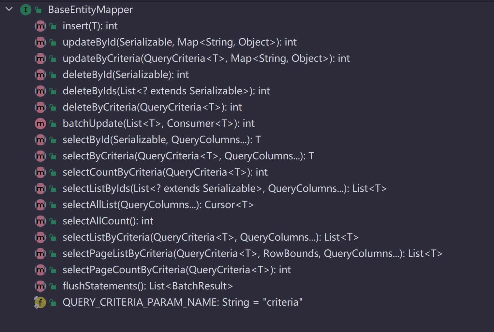

# Mybatis-Tiny

## 目录大纲

- ##### [基本简介](#基本简介-1)

- ##### [快速入门](#快速入门-1)

- ##### [特性及限制](#特性及限制-1)

- ##### [使用方式](#使用方式-1)

- ##### [实现原理](#实现原理-1)

- ##### [注解说明](#注解说明-1)

- ##### [功能示例](#功能示例-1)

- ##### [性能测试](#性能测试-1)


## 基本简介

Mybatis-Tiny是什么？Mybatis-Tiny是一个基于Mybatis框架的一层极简的扩展，它旨在使用DSL的方式对单表进行CRUD操作，类似于Mybatis-Plus框架，但它绝不是重复造轮子！区别于别的类似框架（如Mybatis-Plus、Fluent-Mybatis等）的实现方式，它采用一种逆向曲线救国的实现方式，通过较少的代码，极简的扩展实现了类似于他们大多数的功能，完全满足日常开发中对单表的各种CRUD操作。


## 快速入门

> **Talk is cheap，show me the code！**

- #### 插入操作

  ```java
  ProductBaseInfo productBase = ...;
  List<ProductSaleSpec> productSaleSpecs = ...;
  productBaseInfoMapper.insert(productBase);
  //基于JDBC-Batch特性的批量插入操作。
  productSaleSpecMapper.batchUpdate(productSaleSpecs, 
                                    productSaleSpec -> productSaleSpecMapper.insert(productSaleSpec));
  
  //打印日志：
  
   - ==>  Preparing: INSERT INTO t_product_base_info( product_id, product_name, product_url, product_tags, product_type, audit_status, online_status, shop_id, remark, create_time, update_time ) VALUES ( ?, ?, ?, ?, ?, ?, ?, ?, ?, ?, ? )
   - ==> Parameters: null, 24期免息【当天发】Huawei/华为Mate40 5G手机官方旗舰店50pro直降mate40e官网30正品4G鸿蒙正品30全网通(String), https://detail.tmall.com/item.htm?id=633658852628(String), ["手机通讯","手机","手机"](String), 1(Integer), 0(Integer), 1(Integer), 111212422(Long), null, 2022-04-27 00:43:42(String), 2022-04-27 00:43:42(String)
   - <==    Updates: 1
  
   - ==>  Preparing: INSERT INTO t_product_sale_spec( product_id, spec_no, spec_name, spec_index, remark, create_time, update_time ) VALUES ( ?, ?, ?, ?, ?, ?, ? )
   - ==> Parameters: 1(Long), 101(String), 4G全网通(String), 1(Integer), null, 2022-04-27 00:43:42(String), 2022-04-27 00:43:42(String)
   - ==> Parameters: 1(Long), 102(String), 5G全网通(String), 2(Integer), null, 2022-04-27 00:43:42(String), 2022-04-27 00:43:42(String)
   - ==> Parameters: 1(Long), 201(String), 亮黑色(String), 1(Integer), null, 2022-04-27 00:43:42(String), 2022-04-27 00:43:42(String)
   - ==> Parameters: 1(Long), 202(String), 釉白色(String), 2(Integer), null, 2022-04-27 00:43:42(String), 2022-04-27 00:43:42(String)
   - ==> Parameters: 1(Long), 203(String), 秘银色(String), 3(Integer), null, 2022-04-27 00:43:42(String), 2022-04-27 00:43:42(String)
   - ==> Parameters: 1(Long), 204(String), 夏日胡杨(String), 4(Integer), null, 2022-04-27 00:43:42(String), 2022-04-27 00:43:42(String)
   - ==> Parameters: 1(Long), 205(String), 秋日胡杨(String), 5(Integer), null, 2022-04-27 00:43:42(String), 2022-04-27 00:43:42(String)
   - ==> Parameters: 1(Long), 301(String), 8+128GB(String), 1(Integer), null, 2022-04-27 00:43:42(String), 2022-04-27 00:43:42(String)
   - ==> Parameters: 1(Long), 302(String), 8+256GB(String), 2(Integer), null, 2022-04-27 00:43:42(String), 2022-04-27 00:43:42(String)
  ```
  
  
  
- #### 更新操作

  ```java
  //根据ID更新
  ProductBaseInfo productBase = ...;
  Map<String,Object> updateColumns1 = MapLambdaBuilder.of(productBase)
          //取productBase实例中对应字段的值
          .with(ProductBaseInfo::getProductName)
          .with(ProductBaseInfo::getRemark)
          //如果productBase实例中对应字段的值为空值(null|空串|空数组|空集合)则取default值"1"
          .withDefault(ProductBaseInfo::getProductType, 1)
          //忽略productBase实例中对应字段的值，只取override值"0"
          .withOverride(ProductBaseInfo::getAuditStatus, 0)
          .withOverride(ProductBaseInfo::getOnlineStatus, 0)
          .withOverride(ProductBaseInfo::getUpdateTime, DateTimeUtils.formatNow())
          .build();
  productBaseInfoMapper.updateById(productBase.getProductId(), updateColumns1);
  //productBaseInfoMapper.updateById(productBase.identity(), updateColumns);
  
  //根据条件更新
  Map<String,Object> updateColumns2 = MapLambdaBuilder.<ProductBaseInfo>ofEmpty()
          .withOverride(ProductBaseInfo::getOnlineStatus, 0)
          .withOverride(ProductBaseInfo::getUpdateTime, DateTimeUtils.formatNow())
          .build();
  QueryCriteria<ProductBaseInfo> updateCriteria2 = LambdaQueryCriteria.ofSupplier(ProductBaseInfo::new)
          .eq(ProductBaseInfo::getProductType, 1)
      	.in(ProductBaseInfo::getAuditStatus, 0, 1)
          .limit(5);
  productBaseInfoMapper.updateByCriteria(updateCriteria2, updateColumns2);
  
  //批量更新
  List<ProductSaleStock> productSaleStocks = ...;
  String nowTime = DateTimeUtils.formatNow();
  productSaleStockMapper.batchUpdate(productSaleStocks, productSaleStock -> {
      Map<String,Object> updateColumns = MapLambdaBuilder.of(productSaleStock)
          .withOverride(ProductSaleStock::getSellPrice, productSaleStock.getSellPrice() - productSaleStock.getSellPrice() % 100)
          .withOverride(ProductSaleStock::getUpdateTime, nowTime)
          .build();
      productSaleStockMapper.updateById(productSaleStock.identity(), updateColumns);
  });
  ```
  
- #### 查询操作

  ```java
  //根据ID查
  ProductBaseInfo productBase1 = productBaseInfoMapper.selectById(1L);
  
  ProductBaseInfo productBase2 = productBaseInfoMapper.selectById(10L, new QueryColumns(ProductBaseInfo::getProductId, ProductBaseInfo::getProductName, ProductBaseInfo::getAuditStatus, ProductBaseInfo::getOnlineStatus));
  
  ID id = new ID().addKey(ProductSaleSpec::getProductId, 1L).addKey(ProductSaleSpec::getSpecNo, "101");
  ProductSaleSpec productSaleSpec = productSaleSpecMapper.selectById(id);
  
  //根据多个ID查询
  List<ProductBaseInfo> productBases = productBaseInfoMapper.selectListByIds(Arrays.asList(5L, 6L, 7L, 8L, 9L));
  
  List<ID> ids = new ArrayList<>();
  ids.add(new ID().addKey(ProductSaleSpec::getProductId, 1L).addKey(ProductSaleSpec::getSpecNo, "101"));
  ids.add(new ID().addKey(ProductSaleSpec::getProductId, 1L).addKey(ProductSaleSpec::getSpecNo, "102"));
  ids.add(new ID().addKey(ProductSaleSpec::getProductId, 1L).addKey(ProductSaleSpec::getSpecNo, "103"));
  List<ProductSaleSpec> productSaleSpecs = productSaleSpecMapper.selectListByIds(ids);
  
   - ==>  Preparing: SELECT product_id AS productId, spec_no AS specNo, spec_name AS specName, spec_index AS specIndex, remark AS remark, DATE_FORMAT(create_time, '%Y-%m-%d %T') AS createTime, DATE_FORMAT(update_time, '%Y-%m-%d %T') AS updateTime FROM t_product_sale_spec WHERE (product_id = ? AND spec_no = ?) OR (product_id = ? AND spec_no = ?) OR (product_id = ? AND spec_no = ?)
   - ==> Parameters: 1(Long), 101(String), 1(Long), 102(String), 1(Long), 103(String)
   - <==      Total: 2
  
  //根据条件查询
  QueryCriteria<ProductSaleSpec> queryCriteria1 = LambdaQueryCriteria.ofSupplier(ProductSaleSpec::new)
                  .eq(ProductSaleSpec::getProductId, 1L)
                  .eq(ProductSaleSpec::getSpecNo, "101");
  ProductSaleSpec productSaleSpec = productSaleSpecMapper.selectByCriteria(queryCriteria1);
  
  ProductSaleStock queryRequest1 = ...;
  QueryCriteria<ProductSaleStock> queryCriteria2 = LambdaQueryCriteria.of(queryRequest1)
                  .eq(ProductSaleStock::getProductId)
                  .likeRight(ProductSaleStock::getSpecNo)
                  .between(ProductSaleStock::getStock, queryRequest1.getMinStock(), queryRequest1.getMaxStock())
                  .orderBy(OrderBy.desc(ProductSaleStock::getSellPrice));
  List<ProductSaleStock> productStocks = productSaleStockMapper.selectListByCriteria(queryCriteria2);
  
  QueryCriteria<ProductBaseInfo> queryCriteria3 = LambdaQueryCriteria.of(queryRequest2)
                  .and(nestedCriteria -> nestedCriteria.like(ProductBaseInfo::getProductName, "华为")
                          .or().like(ProductBaseInfo::getProductName, "HUAWEI"))
                  .eq(ProductBaseInfo::getProductType)
                  .eq(ProductBaseInfo::getOnlineStatus)
                  .in(ProductBaseInfo::getAuditStatus, queryRequest.getAuditStatuses().toArray())
                  .orderBy(OrderBy.desc(ProductBaseInfo::getCreateTime))
                  .dynamic(true); //自动过滤掉为空值(null|空串|空数组|空集合)的查询参数
  List<ProductBaseInfo> productBases1 = productBaseInfoMapper.selectListByCriteria(queryCriteria3);
  
  //分页查询1
  Page page = Page.of(1, 10);
  QueryCriteria<ProductBaseInfo> queryCriteria4 = LambdaQueryCriteria.of(queryRequest)
                  .likeRight(ProductBaseInfo::getProductName)
                  .eq(ProductBaseInfo::getProductType)
                  .eq(ProductBaseInfo::getOnlineStatus)
                  .in(ProductBaseInfo::getAuditStatus, queryRequest.getAuditStatuses().toArray())
                  .orderBy(page.getOrderBys())
                  .dynamic(true); //自动过滤掉为空值(null|空串|空数组|空集合)的查询参数(条件)
  List<ProductBaseInfo> productBases2 = productBaseInfoMapper.selectPageListByCriteria(queryCriteria4, new RowBounds(page.offset(), page.limit()));
  //设置总记录数
  page.setTotalRowCount(productBaseInfoMapper.selectPageCountByCriteria(queryCriteria4));
  
  //分页查询2(等效与上面)
  Page page = Page.of(2, 10);
  List<ProductBaseInfo> productBases2 = EntityMapperHelper.selectEntityObjectListByPage(productBaseInfoMapper, queryCriteria4, page);
  ```

- #### 删除操作

  ```java
  //根据ID删除
  productBaseInfoMapper.deleteById(2L);
  productExtraInfoMapper.deleteById(2L);
  
  //根据条件删除
  QueryCriteria<ProductSaleSpec> queryCriteria1 = LambdaQueryCriteria.ofSupplier(ProductSaleSpec::new)
                  .eq(ProductSaleSpec::getProductId, 2L)
                  .limit(5);
  productSaleSpecMapper.deleteByCriteria(queryCriteria1);
  ```

- 更多示例请见：https://github.com/penggle/mybatis-tiny/tree/main/mybatis-tiny-examples


## 特性及限制

- 支持单一主键或联合主键，单一主键时主键策略支持：IDENTITY(数据库自增的)，SEQUENCE(基于序列的)，NONE(无，客户端自己设置主键)

  > 重复造轮子的初衷也是被Mybatis-Plus只能使用单一主键给恶心到了

- 到目前为止，Mybatis-Tiny没有任何可配置的配置项。Mybatis-Tiny的数据库方言配置与Mybatis本身的方言配置一致，即通过databaseId来实现方言。也就是说Mybatis-Tiny的方言数据库类型取自Configuration.databaseId字段，如果应用程序未设置(通过DatabaseIdProvider来设置)，则Mybatis-Tiny会自动设置。

  目前Mybatis-Tiny支持主流的数据库：`mysql，mariadb，oracle，db2，sqlserver，postgresql，h2，hsql，sqlite，clickhouse`

  对于非主流数据库，可参照<a href="#alternativeDbDialect">非主流数据库方言支持</a>

- Entity实体类是基于注解的（注解类的设计基本与JPA的注解规范一致）；实体类必须实现`EntityObject`接口，例如：

  ```java
  @Table("t_product_base_info")
  public class ProductBaseInfo implements EntityObject {
  
      /** 商品ID */
      @Id(strategy=GenerationType.IDENTITY)
      private Long productId;
  
      /** 商品名称 */
      private String productName;
  
  	...
  
      /** 审核状态：0-待审核,1-审核通过,2-审核不通过 */
      private Integer auditStatus;
  
      /** 上下架状态：0-已下架,1-已上架 */
      private Integer onlineStatus;
      
      /** 所属店铺ID */
      //shopId字段在所有update操作时不会被更新(不在update列中)
      @Column(updatable=false)
      private Long shopId;
  
      /** 商品备注 */
      private String remark;
  
      /** 创建时间 */
      //createTime字段在所有update操作时不会被更新(不在update列中)
      @Column(updatable=false, select="DATE_FORMAT({name}, '%Y-%m-%d %T')")
      private String createTime;
  
      /** 最近修改时间 */
      @Column(select="DATE_FORMAT({name}, '%Y-%m-%d %T')")
      private String updateTime;
  
      //以下属于辅助字段
  
      /** productType的查询结果辅助字段 */
      @Transient
      private String productTypeName;
  
      /** auditStatus的查询结果辅助字段 */
      @Transient
      private String auditStatusName;
  
      /** onlineStatus的查询结果辅助字段 */
      @Transient
      private String onlineStatusName;
  
      /** auditStatus的IN查询条件辅助字段 */
      @Transient
      private List<Integer> auditStatuses;
      
      //getter/setter...
      
      /**
       * 实现该方法是可选的!
       * 
       * 返回领域实体的主键值，当存在联合主键时，在CRUD时特别有用
       * 联合主键(com.penglecode.codeforce.common.domain.ID)
       */
      @Override
      public Long identity() {
          return productId;
      }
  
      /**
       * 实现该方法是可选的!
       *
       * 这个方法在所有SELECT操作返回结果集前都会由Mybatis
       * 插件DomainObjectQueryInterceptor自动执行
       * 
       * 通过实现该方法来实现诸如枚举decode能力
       */
      @Override
      public ProductBaseInfo processOutbound() {
          Optional.ofNullable(ProductTypeEnum.of(productType)).map(ProductTypeEnum::getTypeName).ifPresent(this::setProductTypeName);
          Optional.ofNullable(ProductAuditStatusEnum.of(auditStatus)).map(ProductAuditStatusEnum::getStatusName).ifPresent(this::setAuditStatusName);
          Optional.ofNullable(ProductOnlineStatusEnum.of(onlineStatus)).map(ProductOnlineStatusEnum::getStatusName).ifPresent(this::setOnlineStatusName);
          return this;
      }
      
  }
  ```

- 支持基于Lambda的DSL方式查询是必须的，例如：

  ```java
  ProductBaseInfo queryRequest = ...
  QueryCriteria<ProductBaseInfo> queryCriteria = LambdaQueryCriteria.of(queryRequest)
          .likeRight(ProductBaseInfo::getProductName)
          .eq(ProductBaseInfo::getProductType)
          .eq(ProductBaseInfo::getOnlineStatus, 1) //固定某个查询条件值
          .in(ProductBaseInfo::getAuditStatus, queryRequest.getAuditStatuses().toArray())
          .orderBy(OrderBy.desc(ProductBaseInfo::getCreateTime))
          .limit(5)
          .dynamic(true); //自动过滤掉空值(null|空串|空数组|空集合)查询参数;
  List<ProductBaseInfo> productBases = productBaseInfoMapper.selectListByCriteria(queryCriteria);
  ```

- 支持指定SELECT返回列、UPDATE更新列那都是必须的，例如：

  ```java
  //更新指定列
  ProductBaseInfo updateRequest = ...
  Map<String,Object> updateColumns = MapLambdaBuilder.of(updateRequest)
          .with(ProductBaseInfo::getProductName)
          .with(ProductBaseInfo::getRemark)
          .withDefault(ProductBaseInfo::getProductType, 1)
          .withOverride(ProductBaseInfo::getAuditStatus, 0)
          .withOverride(ProductBaseInfo::getOnlineStatus, 0)
          .withOverride(ProductBaseInfo::getUpdateTime, DateTimeUtils.formatNow())
          .build();
  productBaseInfoMapper.updateById(updateRequest.identity(), updateColumns);
  
  //查询返回指定列
  ProductBaseInfo productBase = productBaseInfoMapper.selectById(1L, new QueryColumns(ProductBaseInfo::getProductId, ProductBaseInfo::getProductName, ProductBaseInfo::getAuditStatus, ProductBaseInfo::getOnlineStatus));
  ```

- 自带基于RowBounds的分页功能，不管是调用`BaseEntityMapper#selectPageListByCriteria(QueryCriteria<T>, RowBounds)`还是调用自定义的分页查询方法`XxxMapper#selectXxxListByPage(Xxx condition, RowBounds)`都将会被自动分页，例如：

  ```java
  public List<ProductBaseInfo> queryProductListByPage(ProductBaseInfo queryRequest, Page page) {
      QueryCriteria<ProductBaseInfo>> queryCriteria = LambdaQueryCriteria.of(queryRequest)
                  .like(ProductBaseInfo::getProductName)
                  .eq(ProductBaseInfo::getProductType)
                  .eq(ProductBaseInfo::getOnlineStatus)
                  .in(ProductBaseInfo::getAuditStatus, queryRequest.getAuditStatuses().toArray())
                  .orderBy(page.getOrderBys())
                  .dynamic(true); //自动过滤掉为空值(null|空串|空数组|空集合)的查询参数
      List<ProductBaseInfo> productBases = productBaseInfoMapper.selectPageListByCriteria(queryCriteria, new RowBounds(page.offset(), page.limit()));
      page.setTotalRowCount(productBaseInfoMapper.selectPageCountByCriteria(queryCriteria)); //设置总记录数
      return productBases;
  }
  ```

- 在Xxx实体对象的XxxMapper中自定义方法肯定是可以的：

  见[ProductBaseInfoMapper.xml](https://github.com/penggle/mybatis-tiny/blob/main/mybatis-tiny-examples/mybatis-tiny-examples-common/src/main/java/com/penglecode/codeforce/mybatistiny/examples/dal/mapper/ProductBaseInfoMapper.xml)

- WHERE条件逻辑嵌套查询仅支持嵌套一层（在单表操作中仅支持一层嵌套已经能满足绝大多数要求了），例如：

  ```java
  QueryCriteria<ProductBaseInfo> queryCriteria = LambdaQueryCriteria.of(queryRequest)
                  //仅支持一层嵌套
                  .and(nestedCriteria -> nestedCriteria.like(ProductBaseInfo::getProductName, "华为")
                          .or().like(ProductBaseInfo::getProductName, "HUAWEI"))
                  .eq(ProductBaseInfo::getProductType)
                  .eq(ProductBaseInfo::getOnlineStatus)
                  .in(ProductBaseInfo::getAuditStatus, queryRequest.getAuditStatuses().toArray())
                  .orderBy(page.getOrderBys())
                  .dynamic(true); //自动过滤掉为空值(null|空串|空数组|空集合)的查询参数
  ```

  上面DSL语句的实际输出SQL如下：

  ```sql
  - ==>  Preparing: SELECT t.product_id productId, t.product_name productName, t.product_type productType, t.audit_status auditStatus, t.online_status onlineStatus FROM t_product_base_info t WHERE ( t.product_name like ? OR t.product_name like ? ) AND t.product_type = ? AND t.audit_status in ( ? , ? , ? ) ORDER BY t.create_time DESC LIMIT 0, 10
  - ==> Parameters: %华为%(String), %HUAWEI%(String), 1(Integer), 0(Integer), 1(Integer), 2(Integer)
  - <==      Total: 10
  ```

- 扩展了Mybatis的`org.apache.ibatis.executor.Executor`，叫`DynamicExecutor`，用于解决在使用mybatis-spring框架时在同一个事务中不能切换ExecutorType的蛋疼问题（如果你硬要这么做，你将会得到一个异常：'Cannot change the ExecutorType when there is an existing transaction'），这个Mybatis本身设计导致(SqlSession中固化了ExecutorType)，派生出`DynamicExecutor`就是来解决这个问题的。

- 仅支持单表CRUD操作，不支持多表JOIN，不支持聚合查询(聚合函数+GROUP BY)

  > 写这个框架的当初初衷仅仅是为了能够省去编写XxxMapper.xml，如果做多表JOIN及聚合查询的话，则就失去了使用Mybatis的意义了，还不如直接使用JPA。试想你把一个复杂查询通过DSL的方式写在JAVA代码中，这跟十多年前在JAVA或者JSP代码中写SQL一样，感觉很恶心。

- 仅提供了通用的BaseEntityMapper，没有提供BaseService之类的，[BaseEntityMapper](https://github.com/penggle/mybatis-tiny/blob/main/mybatis-tiny-core/src/main/java/com/penglecode/codeforce/mybatistiny/mapper/BaseEntityMapper.java)的方法如下：

  

- 支持对[BaseEntityMapper](https://github.com/penggle/mybatis-tiny/blob/main/mybatis-tiny-core/src/main/java/com/penglecode/codeforce/mybatistiny/mapper/BaseEntityMapper.java)的扩展，扩展基础Mapper方法是基于约定的，例如存在这样的扩展：

  ```java
  package com.penglecode.codeforce.mybatistiny.examples.extensions;
  
  import com.penglecode.codeforce.common.domain.EntityObject;
  import com.penglecode.codeforce.mybatistiny.dsl.QueryColumns;
  import com.penglecode.codeforce.mybatistiny.mapper.BaseEntityMapper;
  import org.apache.ibatis.annotations.Param;
  
  /**
   * 增强功能的BaseEntityMapper扩展
   *
   * @author pengpeng
   * @version 1.0
   */
  public interface EnhancedBaseMapper<T extends EntityObject> extends BaseEntityMapper<T> {
  
      /**
       * 通过标准MERGE INTO语句来进行合并存储
       *
       * @param mergeEntity       - 被更新的实体对象
       * @param updateColumns     - 如果是update操作，此参数可指定被更新的列
       * @return
       */
      int merge(@Param("mergeEntity") T mergeEntity, @Param("updateColumns") QueryColumns... updateColumns);
  
  }
  ```

  **基于约定的，你必须在同样package下存在**[EnhancedBaseMapper.ftl](https://github.com/penggle/mybatis-tiny/blob/main/mybatis-tiny-examples/mybatis-tiny-examples-common/src/main/java/com/penglecode/codeforce/mybatistiny/examples/extensions/EnhancedBaseMapper.ftl)

  > Freemarker模板中的预置参数集见[EntityMapperTemplateParameter](https://github.com/penggle/mybatis-tiny/blob/main/mybatis-tiny-core/src/main/java/com/penglecode/codeforce/mybatistiny/core/EntityMapperTemplateParameter.java)

  OK，这就扩展好了，就是这么简单！

  

## 使用方式

Mybatis-Tiny是一层很薄的东西，没有任何特性化的自定义配置，其仅依赖Mybatis本身（不依赖于Spring或SpringBoot）

其Maven依赖：

```xml
<dependency>
    <groupId>io.github.penggle</groupId>
    <artifactId>mybatis-tiny-core</artifactId>
    <!-- 版本说明：3.5指的是基于Mybatis 3.5.x版本的意思 -->
    <version>3.5</version>
</dependency>
```


下面列举三种使用场景。

- 只使用Mybatis（无Spring、SpringBoot等大型框架的支持）

  ```java
  //我不管你其他配置是啥，只要sqlSessionFactory实例是通过DecoratedSqlSessionFactoryBuilder弄出来的就行了！！！
  SqlSessionFactoryBuilder sqlSessionFactoryBuilder = new DecoratedSqlSessionFactoryBuilder();
  SqlSessionFactory sqlSessionFactory = sqlSessionFactoryBuilder.build(Resources.getResourceAsStream("mybatis-config.xml"));
  ```

- 仅与Spring框架（准确地说是mybatis-spring）集成使用

  引入相关Maven依赖后在配置类上使用注解`@EnableMybatisTiny`即可，例如：

  ```java
  import com.penglecode.codeforce.mybatistiny.EnableMybatisTiny;
  import com.penglecode.codeforce.mybatistiny.core.DecoratedSqlSessionFactoryBuilder;
  import com.penglecode.codeforce.mybatistiny.examples.BasePackage;
  import com.zaxxer.hikari.HikariConfig;
  import com.zaxxer.hikari.HikariDataSource;
  import org.apache.commons.lang3.ArrayUtils;
  import org.apache.ibatis.annotations.Mapper;
  import org.mybatis.spring.SqlSessionFactoryBean;
  import org.mybatis.spring.annotation.MapperScan;
  import org.springframework.context.EnvironmentAware;
  import org.springframework.context.annotation.Bean;
  import org.springframework.context.annotation.ComponentScan;
  import org.springframework.context.annotation.Configuration;
  import org.springframework.context.annotation.PropertySource;
  import org.springframework.jdbc.datasource.DataSourceTransactionManager;
  import org.springframework.transaction.annotation.EnableTransactionManagement;
  
  @Configuration
  @EnableMybatisTiny
  @EnableTransactionManagement(proxyTargetClass=true)
  @MapperScan(basePackageClasses=BasePackage.class, annotationClass=Mapper.class)
  @ComponentScan(basePackageClasses=BasePackage.class)
  @PropertySource(value="classpath:application.yml", factory=YamlPropertySourceFactory.class)
  public class MybatisConfiguration {
  
      @Bean
      public DataSource dataSource() {
          Properties properties = ...
          return new HikariDataSource(new HikariConfig(properties));
      }
  
      @Bean
      public SqlSessionFactoryBean sqlSessionFactory(DataSource dataSource) {
          SqlSessionFactoryBean sqlSessionFactoryBean = new SqlSessionFactoryBean();
          sqlSessionFactoryBean.setDataSource(dataSource);
          //这里用不用Mybatis-Tiny提供的DecoratedSqlSessionFactoryBuilder是可选的
          //如果不用，在Spring环境下Mybatis-Tiny框架是有应对的弥补措施的
          //sqlSessionFactoryBean.setSqlSessionFactoryBuilder(new DecoratedSqlSessionFactoryBuilder());
          sqlSessionFactoryBean.setConfigLocation(getConfigLocation());
          sqlSessionFactoryBean.setTypeAliasesPackage(getTypeAliasesPackage());
          sqlSessionFactoryBean.setTypeAliasesSuperType(getTypeAliasesSuperType());
          sqlSessionFactoryBean.setMapperLocations(getMapperLocations());
          return sqlSessionFactoryBean;
      }
  
      @Bean
      public DataSourceTransactionManager transactionManager(DataSource dataSource) {
          return new DataSourceTransactionManager(dataSource);
      }
      
      ...
      
  }
  ```

- 仅与SpringBoot框架（准确地说是mybatis-spring-boot-starter）集成使用

  引入相关Maven依赖后在SpringBoot启动类上使用注解`@EnableMybatisTiny`即可，例如：

  ```java
  
  import com.penglecode.codeforce.mybatistiny.EnableMybatisTiny;
  import com.penglecode.codeforce.mybatistiny.examples.BasePackage;
  import org.springframework.boot.autoconfigure.SpringBootApplication;
  
  @EnableMybatisTiny
  @SpringBootApplication(scanBasePackageClasses=BasePackage.class)
  public class MybatisTinyExampleApplication {
  
      public static void main(String[] args) {
          SpringApplication.run(MybatisTinyExampleApplication.class, args);
      }
  
  }
  ```

  `mybatis-spring-boot-starter`及`DataSource`的配置照旧就好了，`application.yml`例如：

  ```yaml
  #SpringBoot应用的名称
  spring:
      application:
          name: mybatis-tiny-examples-springboot
      #Hikari 连接池配置
      datasource:
          hikari:
              #连接池名字
              pool-name: defaultHikariCP
              #最小空闲连接数量
              minimum-idle: 5
              #空闲连接存活最大时间，默认600000(10分钟)
              idle-timeout: 180000
              #连接池最大连接数，默认是10
              maximum-pool-size: 10
              #池中连接的默认自动提交行为，默认值true
              auto-commit: true
              #池中连接的最长生命周期，0表示无限生命周期，默认1800000(30分钟)
              max-lifetime: 1800000
              #等待来自池的连接的最大毫秒数，默认30000(30秒)
              connection-timeout: 30000
              #连接测试语句
              connection-test-query: SELECT 1
          username: root
          password: 123456
          url: jdbc:mysql://127.0.0.1:3306/examples?useUnicode=true&characterEncoding=utf-8&allowMultiQueries=true&serverTimezone=GMT%2B8&useSSL=false&rewriteBatchedStatements=true&useCursorFetch=true
  
  #Mybatis-SpringBoot配置
  mybatis:
      config-location: classpath:config/mybatis/mybatis-config.xml
      mapper-locations: classpath*:com/penglecode/codeforce/mybatistiny/examples/**/*Mapper.xml
      type-aliases-package: com.penglecode.codeforce.mybatistiny.examples
      type-aliases-super-type: com.penglecode.codeforce.common.domain.DomainObject
  ```

- 其他框架集成Mybatis-Tiny

  我不管你其他框架具体是啥，只要sqlSessionFactory实例是通过DecoratedSqlSessionFactoryBuilder弄出来的就行了！！！

## 实现原理

> 区别于别的类似框架（如Mybatis-Plus、Fluent-Mybatis等）的实现方式，它采用一种逆向曲线救国的实现方式，通过较少的代码，极简的扩展实现了类似于他们大多数的功能，完全满足日常开发中对单表的各种CRUD操作。

这是我在上面基本简介中对它的阐述，如果你有一定的基础和兴趣看看源码，再回过头来我想你肯定赞同我上面所言非虚。

- #### 实现要点

  1. [BaseEntityMapper](https://github.com/penggle/mybatis-tiny/blob/main/mybatis-tiny-core/src/main/java/com/penglecode/codeforce/mybatistiny/mapper/BaseEntityMapper.java)的定义：

     ```java
     package com.penglecode.codeforce.mybatistiny.mapper;
     
     import com.penglecode.codeforce.common.domain.EntityObject;
     import com.penglecode.codeforce.mybatistiny.dsl.QueryColumns;
     import com.penglecode.codeforce.mybatistiny.dsl.QueryCriteria;
     import com.penglecode.codeforce.mybatistiny.support.EntityMapperHelper;
     import org.apache.ibatis.annotations.Flush;
     import org.apache.ibatis.annotations.Param;
     import org.apache.ibatis.cursor.Cursor;
     import org.apache.ibatis.executor.BatchResult;
     import org.apache.ibatis.session.RowBounds;
     
     import java.io.Serializable;
     import java.util.List;
     import java.util.Map;
     import java.util.function.Consumer;
     
     /**
      * 实体对象(EntityObject)基本CRUD操作的Mybatis-Mapper基类
      *
      * @author pengpeng
      * @version 1.0
      */
     public interface BaseEntityMapper<T extends EntityObject> extends BaseMapper {
     
         /**
          * 这里需要保持与BaseEntityMapper中的@Param参数名一致
          */
         String QUERY_CRITERIA_PARAM_NAME = "criteria";
     
         /**
          * 插入实体
          *
          * @param entity	- 实体对象
          * @return 返回被更新条数
          */
         int insert(T entity);
     
         /**
          * 根据ID更新指定的实体字段
          *
          * @param id			- 主键ID
          * @param columns		- 被更新的字段键值对
          * @return 返回被更新条数
          */
         int updateById(@Param("id") Serializable id, @Param("columns") Map<String,Object> columns);
     
         /**
          * 根据指定的条件更新指定的实体字段
          *
          * @param criteria		- 更新范围条件(不能为null)
          * @param columns		- 被更新的字段键值对
          * @return 返回被更新条数
          */
         int updateByCriteria(@Param("criteria") QueryCriteria<T> criteria, @Param("columns") Map<String,Object> columns);
     
         /**
          * 根据ID删除实体
          *
          * @param id		- 主键ID
          * @return 返回被删除条数
          */
         int deleteById(@Param("id") Serializable id);
     
         /**
          * 根据多个ID批量删除实体
          *
          * @param ids		- 主键ID列表
          * @return 返回被删除条数
          */
         int deleteByIds(@Param("ids") List<? extends Serializable> ids);
     
         /**
          * 根据指定的条件删除实体数据
          *
          * @param criteria	- 删除范围条件(不能为null)
          * @return 返回被删除条数
          */
         int deleteByCriteria(@Param("criteria") QueryCriteria<T> criteria);
     
         /**
          * 根据指定的updateOperation来批量操作(新增、更新、删除)entityList, 例如：
          *
          * List<Account> accountList = ...;
          *
          * 1、批量新增
          * accountMapper.batchUpdate(accountList, accountMapper::insert);
          *
          * 2、根据ID来批量更新
          * accountMapper.batchUpdate(accountList, (account) -> {
          *      Map<String,Object> updateColumns = MapLambdaBuilder.of(account)
          *              .with(Account::getBalance)
          *              .with(Account::getStatus)
          *              .with(Account::getUpdateTime)
          *              .build();
          *      accountMapper.updateById(account.identity(), updateColumns);
          * });
          *
          * 3、根据自定义条件来批量更新
          * accountMapper.batchUpdate(accountList, (account) -> {
          *      Map<String,Object> updateColumns = MapLambdaBuilder.of(account)
          *              .with(Account::getBalance)
          *              .with(Account::getStatus)
          *              .with(Account::getUpdateTime)
          *              .build();
          *      QueryCriteria<Account> queryCriteria = LambdaQueryCriteria.of(account)
          *              .eq(Account::getIdCard);
          *      accountMapper.updateByCriteria(queryCriteria, updateColumns);
          * });
          *
          * 4、根据ID来批量删除
          * (大批量删除走原生JDBC-Batch)
          * accountMapper.batchUpdate(accountList, account -> accountMapper.deleteById(account.identity()));
          *
          * @return
          */
         default int batchUpdate(List<T> entityList, Consumer<T> updateOperation) {
             return EntityMapperHelper.batchUpdateEntityObjects(entityList, updateOperation, this);
         }
     
         /**
          * 根据ID查询单个结果集
          *
          * @param id		- 主键ID
          * @param columns 	- 指定查询返回的列(这里的列指的是实体对象<T>中的字段)，这里使用JAVA可变参数特性的讨巧写法，实际只取columns[0]为参数
          * @return 返回单个结果集
          */
         T selectById(@Param("id") Serializable id, @Param("columns") QueryColumns... columns);
     
         /**
          * 根据条件获取查询单个结果集
          * (注意：如果匹配到多个结果集将报错)
          *
          * @param criteria	- 查询条件(不能为null)
          * @param columns 	- 指定查询返回的列(这里的列指的是实体对象<T>中的字段)，这里使用JAVA可变参数特性的讨巧写法，实际只取columns[0]为参数
          * @return 返回单个结果集
          */
         T selectByCriteria(@Param("criteria") QueryCriteria<T> criteria, @Param("columns") QueryColumns... columns);
     
         /**
          * 根据条件获取查询COUNT
          *
          * @param criteria	- 查询条件(不能为null)
          * @return 返回单个结果集
          */
         int selectCountByCriteria(@Param("criteria") QueryCriteria<T> criteria);
     
         /**
          * 根据多个ID查询结果集
          *
          * @param ids		- 主键ID列表
          * @param columns 	- 指定查询返回的列(这里的列指的是实体对象<T>中的字段)，这里使用JAVA可变参数特性的讨巧写法，实际只取columns[0]为参数
          * @return 返回结果集
          */
         List<T> selectListByIds(@Param("ids") List<? extends Serializable> ids, @Param("columns") QueryColumns... columns);
     
         /**
          * 查询所有结果集(需要在事务中使用，否则查询不到数据)
          *
          * @param columns 	- 指定查询返回的列(这里的列指的是实体对象<T>中的字段)，这里使用JAVA可变参数特性的讨巧写法，实际只取columns[0]为参数
          * @return 返回所有结果集
          */
         Cursor<T> selectAllList(@Param("columns") QueryColumns... columns);
     
         /**
          * 查询所有结果集计数
          * @return 返回所有记录数
          */
         int selectAllCount();
     
         /**
          * 根据条件查询结果集
          *
          * @param criteria	- 查询条件(为null则查询所有)
          * @param columns 	- 指定查询返回的列(这里的列指的是实体对象<T>中的字段)，这里使用JAVA可变参数特性的讨巧写法，实际只取columns[0]为参数
          * @return 返回结果集
          */
         List<T> selectListByCriteria(@Param("criteria") QueryCriteria<T> criteria, @Param("columns") QueryColumns... columns);
     
         /**
          * 根据条件查询结果集(分页)
          *
          * @param criteria	- 查询条件(为null则查询所有)
          * @param rowBounds	- 分页参数
          * @param columns 	- 指定查询返回的列(这里的列指的是实体对象<T>中的字段)，这里使用JAVA可变参数特性的讨巧写法，实际只取columns[0]为参数
          * @return 返回结果集
          */
         List<T> selectPageListByCriteria(@Param("criteria") QueryCriteria<T> criteria, RowBounds rowBounds, @Param("columns") QueryColumns... columns);
     
         /**
          * 根据条件查询结果集计数
          *
          * @param criteria	- 查询条件(为null则查询所有)
          * @return 返回记录数
          */
         int selectPageCountByCriteria(@Param("criteria") QueryCriteria<T> criteria);
     
         /**
          * 刷新(发送)批量语句到数据库Server端执行，并返回结果
          *
          * @return
          */
         @Flush
         List<BatchResult> flushStatements();
     
     }
     
     ```

     其中我对`updateXxx`类方法为啥传一个Map作为update列的设计做个解释：

     - 回归实际项目中，肯定并不是全部列都需要被update，例如create_time列

     - 你想传Entity对象进来作为参数，然后想值不为空(null、空串)的字段都需要进行update，那么问题来了：有个需求就是要将某个字段update为空(null、空串)，请问这时我怎么能两者兼顾？这个是一个矛盾的事情，没办法兼容

     - 所以综上所述，被update的列改成了Map类型的参数，辅以`MapLambdaBuilder`来解决，就像下面这样使用：

       ```java
       Map<String,Object> updateColumns = MapLambdaBuilder.of(productBase)
                           .with(ProductBaseInfo::getProductName)
                           .with(ProductBaseInfo::getRemark)
                           .with(ProductBaseInfo::getAuditStatus)
                           .withOverride(ProductBaseInfo::getOnlineStatus, 0)
                           .withOverride(ProductBaseInfo::getUpdateTime, nowTime)
                           .build();
       productBaseInfoMapper.updateById(productBase.identity(), updateColumns);
       ```

       

  2. Xxx实体对象的通用Mapper接口（`BaseEntityMapper`）对应的`XxxMapper.xml`是通过freemarker模板([BaseEntityMapper.ftl](https://github.com/penggle/mybatis-tiny/blob/main/mybatis-tiny-core/src/main/java/com/penglecode/codeforce/mybatistiny/mapper/BaseEntityMapper.ftl))在应用启动时（准确地说是在**第一次**调用`Configuration#getMapper(Class type)`方法的时候）自动生成代码的（你可以通过打开日志`\<logger name="com.penglecode.codeforce.mybatistiny" level="DEBUG"/>`查看生成的`XxxMapper.xml`是啥样子），这个自动生成XxxMapper.xml的过程中还需要考虑自定义扩展BaseEntityMapper方法的情况，涉及到XML-Mapper内容的合并。最后通过`org.apache.ibatis.builder.xml.XMLMapperBuilder`加载进入Mybatis的`Configuration`中（实际是变成了许多`MappedStatement`对象了）。

     <u>**这一步解决了偷懒省去编写`XxxMapper.xml`的麻烦事。**</u>

  3. 基于Lambda的DSL方式查询实现通过下面几个组合实现的：

     - `com.penglecode.codeforce.mybatistiny.dsl`包下的[QueryCriteria](https://github.com/penggle/mybatis-tiny/blob/main/mybatis-tiny-core/src/main/java/com/penglecode/codeforce/mybatistiny/dsl/QueryCriteria.java)、[LambdaQueryCriteria](https://github.com/penggle/mybatis-tiny/blob/main/mybatis-tiny-core/src/main/java/com/penglecode/codeforce/mybatistiny/dsl/LambdaQueryCriteria.java)、[NestedLambdaQueryCriteria](https://github.com/penggle/mybatis-tiny/blob/main/mybatis-tiny-core/src/main/java/com/penglecode/codeforce/mybatistiny/dsl/NestedLambdaQueryCriteria.java)等主要实现DSL语法
     - [CommonMybatisMapper.xml](https://github.com/penggle/mybatis-tiny/blob/main/mybatis-tiny-core/src/main/java/com/penglecode/codeforce/mybatistiny/mapper/CommonMybatisMapper.xml)则提供了一个全局公共的Mybatis动态条件语句实现，这里我就不贴源码了。
     - DSL这块的实现三言两语也说不清，还是需要看看源码才能知道其中的巧妙之处。

  4. 简而言之：

     - 某Xxx实体的`XxxMapper.xml`是通过freemarker自动生成代码的
     - DSL是运行时动态条件`QueryCriteria`配合`CommonMybatisMapper.xml`实现的

- #### 解惑示例

  下面这个`ProductBaseInfoMapper.xml`就是自动生成的，可以通过打开日志：

  ```xml
  <logger name="com.penglecode.codeforce.mybatistiny" level="DEBUG"/>
  ```

  在启动时进行查看，其中引用了全局的`CommonMybatisMapper.CommonWhereCriteriaClause`作为动态条件的实现

  ```xml
  <?xml version="1.0" encoding="UTF-8"?>
  <!DOCTYPE mapper PUBLIC "-//mybatis.org//DTD Mapper 3.0//EN" "http://mybatis.org/dtd/mybatis-3-mapper.dtd">
  <mapper namespace="com.penglecode.codeforce.mybatistiny.examples.dal.mapper.ProductBaseInfoMapper">
  
      <!-- Auto-Generation Code Start -->
      <!--
          每个继承BaseEntityMapper的Mybatis-Mapper接口都会自动生成对应的如下XML-Mapper
      -->
  
      <resultMap id="SelectBaseResultMap" type="com.penglecode.codeforce.mybatistiny.examples.domain.model.ProductBaseInfo">
          <id column="productId" jdbcType="BIGINT" property="productId"/>
          <result column="productName" jdbcType="VARCHAR" property="productName" />
          <result column="productUrl" jdbcType="VARCHAR" property="productUrl" />
          <result column="productTags" jdbcType="VARCHAR" property="productTags" />
          <result column="productType" jdbcType="INTEGER" property="productType" />
          <result column="auditStatus" jdbcType="INTEGER" property="auditStatus" />
          <result column="onlineStatus" jdbcType="INTEGER" property="onlineStatus" />
          <result column="shopId" jdbcType="BIGINT" property="shopId" />
          <result column="remark" jdbcType="VARCHAR" property="remark" />
          <result column="createTime" jdbcType="VARCHAR" property="createTime" />
          <result column="updateTime" jdbcType="VARCHAR" property="updateTime" />
      </resultMap>
  
      <sql id="SelectBaseColumnsClause">
          <trim suffixOverrides=",">
              <if test="@com.penglecode.codeforce.mybatistiny.support.XmlMapperHelper@containsColumn(columns, 'productId')">
                  t.product_id   productId,
              </if>
              <if test="@com.penglecode.codeforce.mybatistiny.support.XmlMapperHelper@containsColumn(columns, 'productName')">
                  t.product_name   productName,
              </if>
              <if test="@com.penglecode.codeforce.mybatistiny.support.XmlMapperHelper@containsColumn(columns, 'productUrl')">
                  t.product_url   productUrl,
              </if>
              <if test="@com.penglecode.codeforce.mybatistiny.support.XmlMapperHelper@containsColumn(columns, 'productTags')">
                  t.product_tags   productTags,
              </if>
              <if test="@com.penglecode.codeforce.mybatistiny.support.XmlMapperHelper@containsColumn(columns, 'productType')">
                  t.product_type   productType,
              </if>
              <if test="@com.penglecode.codeforce.mybatistiny.support.XmlMapperHelper@containsColumn(columns, 'auditStatus')">
                  t.audit_status   auditStatus,
              </if>
              <if test="@com.penglecode.codeforce.mybatistiny.support.XmlMapperHelper@containsColumn(columns, 'onlineStatus')">
                  t.online_status   onlineStatus,
              </if>
              <if test="@com.penglecode.codeforce.mybatistiny.support.XmlMapperHelper@containsColumn(columns, 'shopId')">
                  t.shop_id   shopId,
              </if>
              <if test="@com.penglecode.codeforce.mybatistiny.support.XmlMapperHelper@containsColumn(columns, 'remark')">
                  t.remark   remark,
              </if>
              <if test="@com.penglecode.codeforce.mybatistiny.support.XmlMapperHelper@containsColumn(columns, 'createTime')">
                  DATE_FORMAT(t.create_time, '%Y-%m-%d %T')   createTime,
              </if>
              <if test="@com.penglecode.codeforce.mybatistiny.support.XmlMapperHelper@containsColumn(columns, 'updateTime')">
                  DATE_FORMAT(t.update_time, '%Y-%m-%d %T')   updateTime,
              </if>
          </trim>
      </sql>
  
      <sql id="UpdateDynamicColumnsClause">
          <trim suffixOverrides=",">
              <if test="@com.penglecode.codeforce.mybatistiny.support.XmlMapperHelper@containsColumn(columns, 'productName')">
                  t.product_name = #{columns.productName, jdbcType=VARCHAR},
              </if>
              <if test="@com.penglecode.codeforce.mybatistiny.support.XmlMapperHelper@containsColumn(columns, 'productUrl')">
                  t.product_url = #{columns.productUrl, jdbcType=VARCHAR},
              </if>
              <if test="@com.penglecode.codeforce.mybatistiny.support.XmlMapperHelper@containsColumn(columns, 'productTags')">
                  t.product_tags = #{columns.productTags, jdbcType=VARCHAR},
              </if>
              <if test="@com.penglecode.codeforce.mybatistiny.support.XmlMapperHelper@containsColumn(columns, 'productType')">
                  t.product_type = #{columns.productType, jdbcType=INTEGER},
              </if>
              <if test="@com.penglecode.codeforce.mybatistiny.support.XmlMapperHelper@containsColumn(columns, 'auditStatus')">
                  t.audit_status = #{columns.auditStatus, jdbcType=INTEGER},
              </if>
              <if test="@com.penglecode.codeforce.mybatistiny.support.XmlMapperHelper@containsColumn(columns, 'onlineStatus')">
                  t.online_status = #{columns.onlineStatus, jdbcType=INTEGER},
              </if>
              <if test="@com.penglecode.codeforce.mybatistiny.support.XmlMapperHelper@containsColumn(columns, 'remark')">
                  t.remark = #{columns.remark, jdbcType=VARCHAR},
              </if>
              <if test="@com.penglecode.codeforce.mybatistiny.support.XmlMapperHelper@containsColumn(columns, 'updateTime')">
                  t.update_time = #{columns.updateTime, jdbcType=VARCHAR},
              </if>
          </trim>
      </sql>
  
      <insert id="insert" keyProperty="productId" parameterType="ProductBaseInfo" statementType="PREPARED" useGeneratedKeys="true">
          INSERT INTO t_product_base_info(
              product_id,
              product_name,
              product_url,
              product_tags,
              product_type,
              audit_status,
              online_status,
              shop_id,
              remark,
              create_time,
              update_time
          ) VALUES (
              #{productId, jdbcType=BIGINT},
              #{productName, jdbcType=VARCHAR},
              #{productUrl, jdbcType=VARCHAR},
              #{productTags, jdbcType=VARCHAR},
              #{productType, jdbcType=INTEGER},
              #{auditStatus, jdbcType=INTEGER},
              #{onlineStatus, jdbcType=INTEGER},
              #{shopId, jdbcType=BIGINT},
              #{remark, jdbcType=VARCHAR},
              #{createTime, jdbcType=VARCHAR},
              #{updateTime, jdbcType=VARCHAR}
          )
      </insert>
  
      <update id="updateById" parameterType="java.util.Map" statementType="PREPARED">
          UPDATE t_product_base_info t
             SET <include refid="UpdateDynamicColumnsClause"/>
           WHERE t.product_id = #{id, jdbcType=BIGINT}
      </update>
  
      <update id="updateByCriteria" parameterType="java.util.Map" statementType="PREPARED">
          UPDATE t_product_base_info t
             SET <include refid="UpdateDynamicColumnsClause"/>
          <include refid="CommonMybatisMapper.CommonWhereCriteriaClause"/>
      </update>
  
      <delete id="deleteById" parameterType="java.util.Map" statementType="PREPARED">
          DELETE t FROM t_product_base_info t
           WHERE t.product_id = #{id, jdbcType=BIGINT}
      </delete>
  
      <delete id="deleteByIds" parameterType="java.util.Map" statementType="PREPARED">
          DELETE t FROM t_product_base_info t
           WHERE t.product_id in
          <foreach collection="ids" index="index" item="id" open="(" separator="," close=")">
              #{id, jdbcType=BIGINT}
          </foreach>
      </delete>
  
      <delete id="deleteByCriteria" parameterType="java.util.Map" statementType="PREPARED">
          DELETE t FROM t_product_base_info t
          <include refid="CommonMybatisMapper.CommonWhereCriteriaClause"/>
      </delete>
  
      <select id="selectById" parameterType="java.util.Map" resultMap="SelectBaseResultMap" statementType="PREPARED">
          SELECT <include refid="SelectBaseColumnsClause"/>
            FROM t_product_base_info t
           WHERE t.product_id = #{id, jdbcType=BIGINT}
      </select>
  
      <select id="selectByCriteria" parameterType="java.util.Map" resultMap="SelectBaseResultMap" statementType="PREPARED">
          SELECT <include refid="SelectBaseColumnsClause"/>
            FROM t_product_base_info t
          <include refid="CommonMybatisMapper.CommonWhereCriteriaClause"/>
      </select>
  
      <select id="selectCountByCriteria" parameterType="java.util.Map" resultType="java.lang.Integer" statementType="PREPARED">
          SELECT COUNT(*)
            FROM t_product_base_info t
          <include refid="CommonMybatisMapper.CommonWhereCriteriaClause"/>
      </select>
  
      <select id="selectListByIds" parameterType="java.util.Map" resultMap="SelectBaseResultMap" statementType="PREPARED">
          SELECT <include refid="SelectBaseColumnsClause"/>
            FROM t_product_base_info t
           WHERE t.product_id in
          <foreach collection="ids" index="index" item="id" open="(" separator="," close=")">
              #{id, jdbcType=BIGINT}
          </foreach>
      </select>
  
      <select id="selectAllList" parameterType="java.util.Map" resultMap="SelectBaseResultMap" resultSetType="FORWARD_ONLY" statementType="PREPARED">
          SELECT <include refid="SelectBaseColumnsClause"/>
            FROM t_product_base_info t
      </select>
  
      <select id="selectAllCount" parameterType="java.util.Map" resultType="java.lang.Integer" statementType="PREPARED">
          SELECT COUNT(*) FROM t_product_base_info t
      </select>
  
      <select id="selectListByCriteria" parameterType="java.util.Map" resultMap="SelectBaseResultMap" statementType="PREPARED">
          SELECT <include refid="SelectBaseColumnsClause"/>
            FROM t_product_base_info t
          <include refid="CommonMybatisMapper.CommonWhereCriteriaClause"/>
          <include refid="CommonMybatisMapper.CommonOrderByCriteriaClause"/>
      </select>
  
      <select id="selectPageListByCriteria" parameterType="java.util.Map" resultMap="SelectBaseResultMap" statementType="PREPARED">
          SELECT <include refid="SelectBaseColumnsClause"/>
            FROM t_product_base_info t
          <include refid="CommonMybatisMapper.CommonWhereCriteriaClause"/>
          <include refid="CommonMybatisMapper.CommonOrderByCriteriaClause"/>
      </select>
  
      <select id="selectPageCountByCriteria" parameterType="java.util.Map" resultType="java.lang.Integer" statementType="PREPARED">
          SELECT COUNT(*)
            FROM t_product_base_info t
          <include refid="CommonMybatisMapper.CommonWhereCriteriaClause"/>
      </select>
      <!-- Auto-Generation Code End -->
  
  </mapper>
  ```


## 注解说明

全部注解都在包`com.penglecode.codeforce.mybatistiny.annotations`下

- ##### @Table
  
  - name：必填，用于指定表名
  
- ##### @Id
  
  - strategy：取值GenerationType.NONE，GenerationType.IDENTITY，GenerationType.SEQUENCE三个值，默认为GenerationType.NONE
  - generator：仅在strategy=GenerationType.SEQUENCE时用于指定sequence的名称
  - updatable：主键是否包含在UPDATE列中，默认为false
  
- ##### @GenerationType
  
  - SEQUENCE：采用数据库序列来生成主键，例如Oracle数据库
  - IDENTITY：自增主键，大多数数据库都支持整数类型自增主键，例如MySQL、DB2、SQLServer、PG
  - NONE：由客户端程序自己生成主键并在插入之前设置好
  
- ##### @Column
  
  - name：映射数据库表的列名，不填则使用默认转换规则(camel <=> Snake)
  - insertable：当前字段是否包含在INSERT列中? 默认true
  - updatable：当前字段是否包含在UPDATE列中? 默认true
  - select：当前字段的select子句，主要用来实现Formatter功能，例如：DATE_FORMAT({name}, '%Y-%m-%d %T')
  - jdbcType：当前字段的JDBC类型，默认JdbcType.UNDEFINED
  - typeHandler：当前字段的TypeHandler类型，默认UnknownTypeHandler
  
- ##### @Transient

  被注解的字段，将不会参与数据库字段映射(非持久化字段)


## 功能示例

- ##### <a name="alternativeDbDialect">非主流数据库方言支持</a>

  对于非主流数据库，例如"人大金仓数据库(`kingbasees`)"，它属于`Postgresql`系列的，那么采用别名的方式，使用PostgresqlDialect作为其方言，即这样配置：

  方式1：在mybatis-config.xml配置

  ```java
  <databaseIdProvider type="DB_VENDOR">
      <property name="KingBase" value="postgresql" />
  </databaseIdProvider>
  ```

  方式2：Mybatis与Spring集成环境下，通过注册DatabaseIdProvider bean来配置

  ```java
  @Bean
  public DatabaseIdProvider databaseIdProvider() {
      VendorDatabaseIdProvider databaseIdProvider = new VendorDatabaseIdProvider()
      Properties properties = new Properties();
      properties.put("KingBase", "postgresql");
      databaseIdProvider.setProperties(properties);
      return databaseIdProvider;
  }
  ```

  

- ##### 自带Jackson2TypeHandler对JSON字段的处理

  像Mybatis-Plus框架一样Mybatis-Tiny也可以对某个字段设置TypeHandler，例如：

  ```java
  @Table("t_component_meta")
  public class ComponentMeta implements EntityObject {
  
      private static final long serialVersionUID = 1L;
  
      /** 组件代码 */
      @Id(strategy=GenerationType.NONE)
      private String componentCode;
  
      /** 组件名称 */
      private String componentName;
  
      /** 组件类型*/
      private String componentType;
  
      /** 组件属性 */
      //字段类型带泛型,需要对Jackson2TypeHandler进行扩展,以期在编译期就能确定泛型的类型
      @Column(typeHandler=ComponentPropsTypeHandler.class)
      private Map<String,Object> componentProps;
  
      /** 组件API列表 */
      //字段类型带泛型,需要对Jackson2TypeHandler进行扩展,以期在编译期就要确定泛型的类型
      @Column(typeHandler=ComponentApisTypeHandler.class)
      private List<ComponentApiMeta> componentApis;
  
      /** 组件API列表 */
      //字段类型不带泛型,直接用Jackson2TypeHandler就可以了
      @Column(typeHandler=Jackson2TypeHandler.class)
      private ComponentDocMeta componentDoc;
  
      /** 创建时间 */
      @Column(updatable=false, select="DATE_FORMAT({name}, '%Y-%m-%d %T')")
      private String createTime;
  
      /** 最近修改时间 */
      @Column(select="DATE_FORMAT({name}, '%Y-%m-%d %T')")
      private String updateTime;
      
      ...
  }
  ```

  具体见示例代码：

  - [ComponentMeta.java](https://github.com/penggle/mybatis-tiny/blob/main/mybatis-tiny-examples/mybatis-tiny-examples-common/src/main/java/com/penglecode/codeforce/mybatistiny/examples/domain/model/ComponentMeta.java)
  - [TypeHandlerTestBySpring.java](https://github.com/penggle/mybatis-tiny/blob/main/mybatis-tiny-examples/mybatis-tiny-examples-spring/src/test/java/com/penglecode/codeforce/mybatistiny/examples/test/TypeHandlerTestBySpring.java)

- ##### 覆盖或扩展BaseEntityMapper中的方法

  具体见mybatis-tiny-examples-common/com.penglecode.codeforce.mybatistiny.examples.extensions包下的示例代码：

  - [EnhancedBaseMapper.java](https://github.com/penggle/mybatis-tiny/blob/main/mybatis-tiny-examples/mybatis-tiny-examples-common/src/main/java/com/penglecode/codeforce/mybatistiny/examples/extensions/EnhancedBaseMapper.java)
  - [EnhancedBaseMapper.ftl](https://github.com/penggle/mybatis-tiny/blob/main/mybatis-tiny-examples/mybatis-tiny-examples-common/src/main/java/com/penglecode/codeforce/mybatistiny/examples/extensions/EnhancedBaseMapper.ftl)
  - [MysqlBaseMapper.java](https://github.com/penggle/mybatis-tiny/blob/main/mybatis-tiny-examples/mybatis-tiny-examples-common/src/main/java/com/penglecode/codeforce/mybatistiny/examples/extensions/MysqlBaseMapper.java)
  - [MysqlBaseMapper.ftl](https://github.com/penggle/mybatis-tiny/blob/main/mybatis-tiny-examples/mybatis-tiny-examples-common/src/main/java/com/penglecode/codeforce/mybatistiny/examples/extensions/MysqlBaseMapper.ftl)
  - [CustomMapperTestBySpring.java](https://github.com/penggle/mybatis-tiny/blob/main/mybatis-tiny-examples/mybatis-tiny-examples-spring/src/test/java/com/penglecode/codeforce/mybatistiny/examples/test/CustomMapperTestBySpring.java)

- ##### 批量插入、更新、删除的正确使用姿势

  Mybatis-Tiny提供的实体Mapper基类[BaseEntityMapper](https://github.com/penggle/mybatis-tiny/blob/main/mybatis-tiny-core/src/main/java/com/penglecode/codeforce/mybatistiny/mapper/BaseEntityMapper.java)中就定义了一个批量方法：
  
  ```java
  /**
       * 根据指定的updateOperation来批量操作(新增、更新、删除)entityList, 例如：
       *
       * List<Account> accountList = ...;
       *
       * 1、批量新增
       * accountMapper.batchUpdate(accountList, accountMapper::insert);
       *
       * 2、根据ID来批量更新
       * accountMapper.batchUpdate(accountList, (account) -> {
       *      Map<String,Object> updateColumns = MapLambdaBuilder.of(account)
       *              .with(Account::getBalance)
       *              .with(Account::getStatus)
       *              .with(Account::getUpdateTime)
       *              .build();
       *      accountMapper.updateById(account.identity(), updateColumns);
       * });
       *
       * 3、根据自定义条件来批量更新
       * accountMapper.batchUpdate(accountList, (account) -> {
       *      Map<String,Object> updateColumns = MapLambdaBuilder.of(account)
       *              .with(Account::getBalance)
       *              .with(Account::getStatus)
       *              .with(Account::getUpdateTime)
       *              .build();
       *      QueryCriteria<Account> queryCriteria = LambdaQueryCriteria.of(account)
       *              .eq(Account::getIdCard);
       *      accountMapper.updateByCriteria(queryCriteria, updateColumns);
       * });
       *
       * 4、根据ID来批量删除
       * (大批量删除走原生JDBC-Batch)
       * accountMapper.batchUpdate(accountList, account -> accountMapper.deleteById(account.identity()));
       *
       * @return
       */
      default int batchUpdate(List<T> entityList, Consumer<T> updateOperation) {
          return EntityMapperHelper.batchUpdateEntityObjects(entityList, updateOperation, this);
      }
  ```
  
  该`batchUpdate(..)`方法是`default`类型的，因此不会被Mybatis自动代理。其使用JDBC-Batch特性，支持批量INSERT、批量UPDATE、批量DELETE等操作。
  
  > 顺便说一句：对于MySQL不建议在XML中使用\<foreach/>来拼接insert into values(..),(..),(...);诚然MySQL底层驱动在开启JDBC-Batch特性时也是将多条单个insert语句改写成insert into multi values的形式，但是作为客户端程序通过\<foreach/>来人为insert into multi values语句，无法掌握SQL语句字节大小，小了体现不出来JDBC-Batch特性的威力，大了容易报错，所以这个度还是让驱动自己去掌控。
  >
  > 注意对于MySQL需要开启秘籍参数(rewriteBatchedStatements=true)才能正在开启JDBC-Batch特性
  
  

## 性能测试

机器配置：Intel(R) Core(TM) i7-11800H @ 2.30GHz  RAM32GB Windows10 64位操作系统

基于JMH的性能基准测试（测试用例：[PerformanceTestBySpring.java](https://github.com/penggle/mybatis-tiny/blob/main/mybatis-tiny-examples/mybatis-tiny-examples-spring/src/test/java/com/penglecode/codeforce/mybatistiny/examples/test/PerformanceTestBySpring.java)），多次测试大致结果如下：

```shell
"C:\Program Files\Java\jdk1.8.0_311\bin\java.exe" "-javaagent:D:\Program Files\ideaIU-2021.2.3\lib\idea_rt.jar=13413:D:\Program Files\ideaIU-2021.2.3\bin" -Dfile.encoding=UTF-8 -classpath "C:\Program Files\Java\jdk1.8.0_311\jre\lib\charsets.jar;C:\Program Files\Java\jdk1.8.0_311\jre\lib\deploy.jar;C:\Program Files\Java\jdk1.8.0_311\jre\lib\ext\access-bridge-64.jar;C:\Program Files\Java\jdk1.8.0_311\jre\lib\ext\cldrdata.jar;C:\Program Files\Java\jdk1.8.0_311\jre\lib\ext\dnsns.jar;C:\Program Files\Java\jdk1.8.0_311\jre\lib\ext\jaccess.jar;C:\Program Files\Java\jdk1.8.0_311\jre\lib\ext\jfxrt.jar;C:\Program Files\Java\jdk1.8.0_311\jre\lib\ext\localedata.jar;C:\Program Files\Java\jdk1.8.0_311\jre\lib\ext\nashorn.jar;C:\Program Files\Java\jdk1.8.0_311\jre\lib\ext\sunec.jar;C:\Program Files\Java\jdk1.8.0_311\jre\lib\ext\sunjce_provider.jar;C:\Program Files\Java\jdk1.8.0_311\jre\lib\ext\sunmscapi.jar;C:\Program Files\Java\jdk1.8.0_311\jre\lib\ext\sunpkcs11.jar;C:\Program Files\Java\jdk1.8.0_311\jre\lib\ext\zipfs.jar;C:\Program Files\Java\jdk1.8.0_311\jre\lib\javaws.jar;C:\Program Files\Java\jdk1.8.0_311\jre\lib\jce.jar;C:\Program Files\Java\jdk1.8.0_311\jre\lib\jfr.jar;C:\Program Files\Java\jdk1.8.0_311\jre\lib\jfxswt.jar;C:\Program Files\Java\jdk1.8.0_311\jre\lib\jsse.jar;C:\Program Files\Java\jdk1.8.0_311\jre\lib\management-agent.jar;C:\Program Files\Java\jdk1.8.0_311\jre\lib\plugin.jar;C:\Program Files\Java\jdk1.8.0_311\jre\lib\resources.jar;C:\Program Files\Java\jdk1.8.0_311\jre\lib\rt.jar;D:\GIT\mybatis-tiny\mybatis-tiny-examples\mybatis-tiny-examples-spring\target\test-classes;D:\GIT\mybatis-tiny\mybatis-tiny-examples\mybatis-tiny-examples-spring\target\classes;D:\GIT\mybatis-tiny\mybatis-tiny-examples\mybatis-tiny-examples-common\target\classes;C:\Users\Pengle\.m2\repository\com\google\guava\guava\30.0-jre\guava-30.0-jre.jar;C:\Users\Pengle\.m2\repository\com\google\guava\failureaccess\1.0.1\failureaccess-1.0.1.jar;C:\Users\Pengle\.m2\repository\com\google\guava\listenablefuture\9999.0-empty-to-avoid-conflict-with-guava\listenablefuture-9999.0-empty-to-avoid-conflict-with-guava.jar;C:\Users\Pengle\.m2\repository\com\google\code\findbugs\jsr305\3.0.2\jsr305-3.0.2.jar;C:\Users\Pengle\.m2\repository\org\checkerframework\checker-qual\3.5.0\checker-qual-3.5.0.jar;C:\Users\Pengle\.m2\repository\com\google\errorprone\error_prone_annotations\2.3.4\error_prone_annotations-2.3.4.jar;C:\Users\Pengle\.m2\repository\com\google\j2objc\j2objc-annotations\1.3\j2objc-annotations-1.3.jar;C:\Users\Pengle\.m2\repository\io\github\penggle\codeforce-common-domain\2.4\codeforce-common-domain-2.4.jar;C:\Users\Pengle\.m2\repository\io\github\penggle\codeforce-common-base\2.4\codeforce-common-base-2.4.jar;C:\Users\Pengle\.m2\repository\org\apache\commons\commons-lang3\3.12.0\commons-lang3-3.12.0.jar;C:\Users\Pengle\.m2\repository\com\fasterxml\jackson\core\jackson-databind\2.11.4\jackson-databind-2.11.4.jar;C:\Users\Pengle\.m2\repository\com\fasterxml\jackson\core\jackson-annotations\2.11.4\jackson-annotations-2.11.4.jar;C:\Users\Pengle\.m2\repository\com\fasterxml\jackson\core\jackson-core\2.11.4\jackson-core-2.11.4.jar;C:\Users\Pengle\.m2\repository\com\fasterxml\jackson\datatype\jackson-datatype-jdk8\2.11.4\jackson-datatype-jdk8-2.11.4.jar;C:\Users\Pengle\.m2\repository\com\fasterxml\jackson\datatype\jackson-datatype-jsr310\2.11.4\jackson-datatype-jsr310-2.11.4.jar;D:\GIT\mybatis-tiny\mybatis-tiny-base\target\classes;C:\Users\Pengle\.m2\repository\org\openjdk\jmh\jmh-generator-annprocess\1.35\jmh-generator-annprocess-1.35.jar;C:\Users\Pengle\.m2\repository\org\openjdk\jmh\jmh-core\1.35\jmh-core-1.35.jar;C:\Users\Pengle\.m2\repository\net\sf\jopt-simple\jopt-simple\5.0.4\jopt-simple-5.0.4.jar;C:\Users\Pengle\.m2\repository\org\apache\commons\commons-math3\3.2\commons-math3-3.2.jar;C:\Users\Pengle\.m2\repository\org\slf4j\slf4j-api\1.7.30\slf4j-api-1.7.30.jar;C:\Users\Pengle\.m2\repository\ch\qos\logback\logback-classic\1.2.3\logback-classic-1.2.3.jar;C:\Users\Pengle\.m2\repository\ch\qos\logback\logback-core\1.2.3\logback-core-1.2.3.jar;C:\Users\Pengle\.m2\repository\org\apache\logging\log4j\log4j-to-slf4j\2.13.3\log4j-to-slf4j-2.13.3.jar;C:\Users\Pengle\.m2\repository\org\apache\logging\log4j\log4j-api\2.13.3\log4j-api-2.13.3.jar;C:\Users\Pengle\.m2\repository\org\slf4j\jul-to-slf4j\1.7.30\jul-to-slf4j-1.7.30.jar;C:\Users\Pengle\.m2\repository\org\springframework\spring-context\5.3.6\spring-context-5.3.6.jar;C:\Users\Pengle\.m2\repository\org\springframework\spring-aop\5.3.6\spring-aop-5.3.6.jar;C:\Users\Pengle\.m2\repository\org\springframework\spring-beans\5.3.6\spring-beans-5.3.6.jar;C:\Users\Pengle\.m2\repository\org\springframework\spring-core\5.3.6\spring-core-5.3.6.jar;C:\Users\Pengle\.m2\repository\org\springframework\spring-jcl\5.3.6\spring-jcl-5.3.6.jar;C:\Users\Pengle\.m2\repository\org\springframework\spring-expression\5.3.6\spring-expression-5.3.6.jar;C:\Users\Pengle\.m2\repository\org\springframework\spring-tx\5.3.6\spring-tx-5.3.6.jar;C:\Users\Pengle\.m2\repository\org\springframework\spring-jdbc\5.3.6\spring-jdbc-5.3.6.jar;D:\GIT\mybatis-tiny\mybatis-tiny-core\target\classes;C:\Users\Pengle\.m2\repository\org\freemarker\freemarker\2.3.31\freemarker-2.3.31.jar;C:\Users\Pengle\.m2\repository\org\mybatis\mybatis\3.5.6\mybatis-3.5.6.jar;C:\Users\Pengle\.m2\repository\org\mybatis\mybatis-spring\2.0.6\mybatis-spring-2.0.6.jar;C:\Users\Pengle\.m2\repository\org\yaml\snakeyaml\1.27\snakeyaml-1.27.jar;C:\Users\Pengle\.m2\repository\com\zaxxer\HikariCP\3.4.5\HikariCP-3.4.5.jar;C:\Users\Pengle\.m2\repository\mysql\mysql-connector-java\8.0.25\mysql-connector-java-8.0.25.jar;C:\Users\Pengle\.m2\repository\com\google\protobuf\protobuf-java\3.11.4\protobuf-java-3.11.4.jar;C:\Users\Pengle\.m2\repository\org\springframework\spring-test\5.3.6\spring-test-5.3.6.jar;C:\Users\Pengle\.m2\repository\org\junit\jupiter\junit-jupiter\5.7.1\junit-jupiter-5.7.1.jar;C:\Users\Pengle\.m2\repository\org\junit\jupiter\junit-jupiter-api\5.7.1\junit-jupiter-api-5.7.1.jar;C:\Users\Pengle\.m2\repository\org\apiguardian\apiguardian-api\1.1.0\apiguardian-api-1.1.0.jar;C:\Users\Pengle\.m2\repository\org\opentest4j\opentest4j\1.2.0\opentest4j-1.2.0.jar;C:\Users\Pengle\.m2\repository\org\junit\platform\junit-platform-commons\1.7.1\junit-platform-commons-1.7.1.jar;C:\Users\Pengle\.m2\repository\org\junit\jupiter\junit-jupiter-params\5.7.1\junit-jupiter-params-5.7.1.jar;C:\Users\Pengle\.m2\repository\org\junit\jupiter\junit-jupiter-engine\5.7.1\junit-jupiter-engine-5.7.1.jar;C:\Users\Pengle\.m2\repository\org\junit\platform\junit-platform-engine\1.7.1\junit-platform-engine-1.7.1.jar" com.penglecode.codeforce.mybatistiny.examples.test.PerformanceTestBySpring
# JMH version: 1.35
# VM version: JDK 1.8.0_311, Java HotSpot(TM) 64-Bit Server VM, 25.311-b11
# VM invoker: C:\Program Files\Java\jdk1.8.0_311\jre\bin\java.exe
# VM options: -javaagent:D:\Program Files\ideaIU-2021.2.3\lib\idea_rt.jar=13413:D:\Program Files\ideaIU-2021.2.3\bin -Dfile.encoding=UTF-8
# Blackhole mode: full + dont-inline hint (auto-detected, use -Djmh.blackhole.autoDetect=false to disable)
# Warmup: 5 iterations, 1 s each
# Measurement: 5 iterations, 1 s each
# Timeout: 10 min per iteration
# Threads: 16 threads, will synchronize iterations
# Benchmark mode: Average time, time/op
# Benchmark: com.penglecode.codeforce.mybatistiny.examples.test.PerformanceTestBySpring.selectProductsByConditionTest

# Run progress: 0.00% complete, ETA 00:00:20
# Fork: 1 of 1
# Warmup Iteration   1: 2761.165 ±(99.9%) 410.214 us/op
# Warmup Iteration   2: 1554.748 ±(99.9%) 128.554 us/op
# Warmup Iteration   3: 1015.426 ±(99.9%) 100.778 us/op
# Warmup Iteration   4: 1009.242 ±(99.9%) 97.470 us/op
# Warmup Iteration   5: 995.272 ±(99.9%) 101.068 us/op
Iteration   1: 999.417 ±(99.9%) 102.929 us/op
Iteration   2: 1010.243 ±(99.9%) 103.908 us/op
Iteration   3: 1010.699 ±(99.9%) 108.932 us/op
Iteration   4: 1004.568 ±(99.9%) 105.673 us/op
Iteration   5: 1017.957 ±(99.9%) 105.427 us/op


Result "com.penglecode.codeforce.mybatistiny.examples.test.PerformanceTestBySpring.selectProductsByConditionTest":
  1008.577 ±(99.9%) 26.902 us/op [Average]
  (min, avg, max) = (999.417, 1008.577, 1017.957), stdev = 6.986
  CI (99.9%): [981.675, 1035.478] (assumes normal distribution)


# JMH version: 1.35
# VM version: JDK 1.8.0_311, Java HotSpot(TM) 64-Bit Server VM, 25.311-b11
# VM invoker: C:\Program Files\Java\jdk1.8.0_311\jre\bin\java.exe
# VM options: -javaagent:D:\Program Files\ideaIU-2021.2.3\lib\idea_rt.jar=13413:D:\Program Files\ideaIU-2021.2.3\bin -Dfile.encoding=UTF-8
# Blackhole mode: full + dont-inline hint (auto-detected, use -Djmh.blackhole.autoDetect=false to disable)
# Warmup: 5 iterations, 1 s each
# Measurement: 5 iterations, 1 s each
# Timeout: 10 min per iteration
# Threads: 16 threads, will synchronize iterations
# Benchmark mode: Average time, time/op
# Benchmark: com.penglecode.codeforce.mybatistiny.examples.test.PerformanceTestBySpring.selectProductsByCriteriaTest

# Run progress: 50.00% complete, ETA 00:00:13
# Fork: 1 of 1
# Warmup Iteration   1: 4105.507 ±(99.9%) 781.593 us/op
# Warmup Iteration   2: 2255.710 ±(99.9%) 248.330 us/op
# Warmup Iteration   3: 1228.765 ±(99.9%) 36.033 us/op
# Warmup Iteration   4: 1229.815 ±(99.9%) 32.962 us/op
# Warmup Iteration   5: 1218.356 ±(99.9%) 32.701 us/op
Iteration   1: 1211.893 ±(99.9%) 35.373 us/op
Iteration   2: 1216.603 ±(99.9%) 34.442 us/op
Iteration   3: 1231.756 ±(99.9%) 34.803 us/op
Iteration   4: 1226.538 ±(99.9%) 33.961 us/op
Iteration   5: 1233.974 ±(99.9%) 35.074 us/op


Result "com.penglecode.codeforce.mybatistiny.examples.test.PerformanceTestBySpring.selectProductsByCriteriaTest":
  1224.153 ±(99.9%) 36.898 us/op [Average]
  (min, avg, max) = (1211.893, 1224.153, 1233.974), stdev = 9.582
  CI (99.9%): [1187.255, 1261.050] (assumes normal distribution)


# Run complete. Total time: 00:00:27

REMEMBER: The numbers below are just data. To gain reusable insights, you need to follow up on
why the numbers are the way they are. Use profilers (see -prof, -lprof), design factorial
experiments, perform baseline and negative tests that provide experimental control, make sure
the benchmarking environment is safe on JVM/OS/HW level, ask for reviews from the domain experts.
Do not assume the numbers tell you what you want them to tell.

Benchmark                                              Mode  Cnt     Score    Error  Units
PerformanceTestBySpring.selectProductsByConditionTest  avgt    5  1008.577 ± 26.902  us/op
PerformanceTestBySpring.selectProductsByCriteriaTest   avgt    5  1224.153 ± 36.898  us/op

Process finished with exit code 0

```


